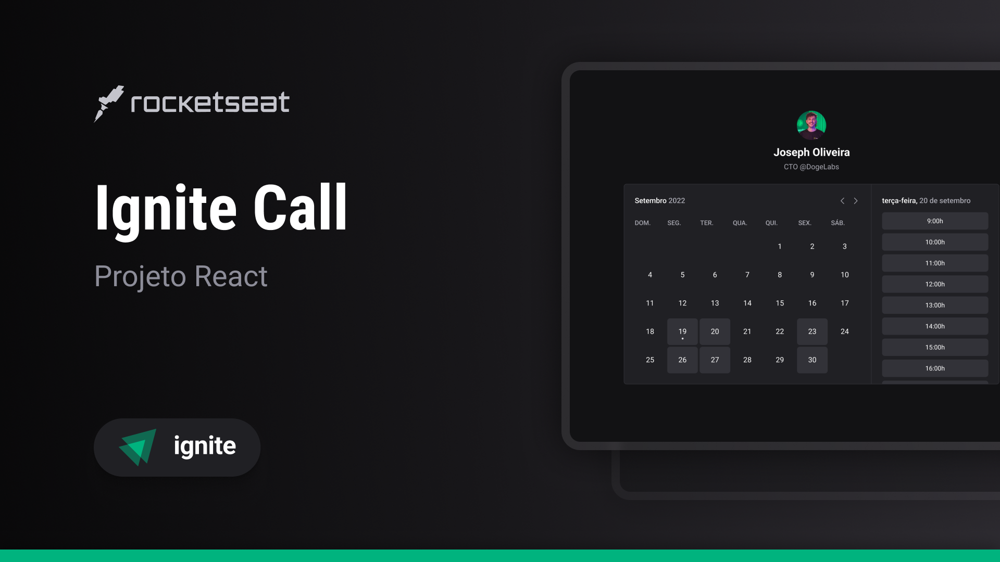

# Design System

Este design system foi desenvolvido a partir do módulo de Design System da trilha de ReactJS da Rocketseat para ser utilizado posteriormente para a aplicação Ignite Call do módulo final do treinamento, isso possibilita que os componentes sejam utilizados em outras aplicações com a mesma base de estilos. No desenvolvimento do design system utilizei o [Tsup](https://tsup.egoist.dev/) para facilitar a compilação de typescript para javascript além de suporte a múltiplos formatos, como ESM e CJS, [Turborepo](https://turbo.build/) no qual sua utilidade é o gerenciamento de projetos monorepos, [Lucide](https://lucide.dev/) para ícones, [Radix UI](https://www.radix-ui.com/primitives) que auxiliou para criar alguns componentes,  [tailwind-variants](https://www.tailwind-variants.org/), para criação de componentes utilizando estilização com [TailwindCSS](https://tailwindcss.com/), [tailwind-merge](https://github.com/dcastil/tailwind-merge), biblioteca que a auxilia na criação de componentes e para finalizar [Storybook](https://storybook.js.org/) para documentar todo design system.
Algo que venho utilizando bastante é a biblioteca da rocketseat [eslint-config-rocketseat](https://github.com/Rocketseat/eslint-config-rocketseat) como uma boa configuração ESlint e formatação com Prettier.

#### Plus +

- Adicionando o compoennte Tooltip
- Adicionando o componente Toast

## Tecnologias Utilizadas


## Instalando o design system:


```javascript

npm install @camposweb-ignite-ui/react

pnpm add @camposweb-ignite-ui/react

yarn add @camposweb-ignite-ui/react

```

## Acessar documentação do design system
[https://camposweb.github.io/06-design-system/](https://camposweb.github.io/06-design-system/)
